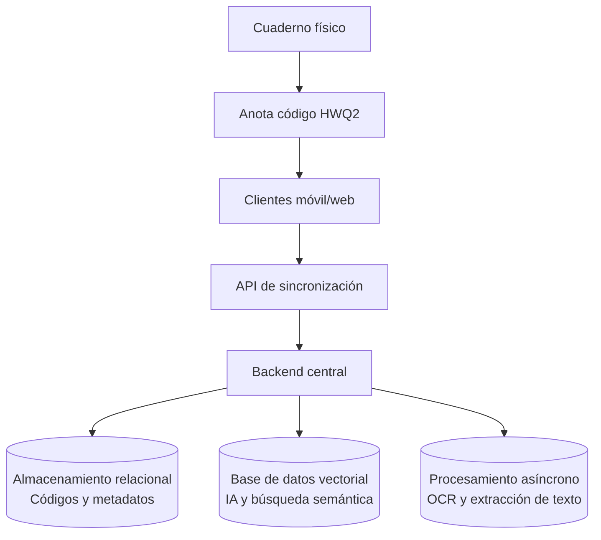

# PaperLink v2 — Especificación de Visión y Arquitectura General

## 1. Visión del Producto

PaperLink es un sistema de Gestión del Conocimiento Personal (PKM) diseñado para tender un puente directo entre el mundo físico (cuadernos de papel) y el ecosistema digital del estudiante (móvil, PC Windows, Web).

## 2. Los Pilares del Sistema

### A. El Enlace Físico-Digital

- Códigos de 4 caracteres no ambiguos (ej. HWQ2).
- Incrustación en papel a mano y recuperación instantánea.

### B. Sincronización y Acceso Multiplataforma

- Backend centralizado con arquitectura cliente-servidor.
- Cliente Web/Escritorio para consulta desde Windows.
- Sincronización bidireccional de datos.

### C. Procesamiento de Contenido e IA

- Búsqueda semántica y contextual mediante Bases de Datos Vectoriales (embeddings).
- Búsqueda literal en archivos (PDFs, Markdown, notas).
- Asistente de estudio basado en RAG sobre el material propio.

### D. Digitalización e Interactividad del Cuaderno

- OCR para conversión de manuscritos a texto digital.
- Hipervínculos interactivos cliqueables sobre los códigos detectados en las fotos.
- Exportación de cuadernos digitales completos.

### E. Contextualización Automática

- Etiquetado sugerido cruzando hora de captura con horario de cursada.
- Granularidad para vincular páginas específicas de un PDF.

## 3. Diagrama Conceptual del Flujo de Datos

## 4. Roadmap Modular

1. Base de Datos Central y API de Sincronización.
2. Cliente Web de Consulta.
3. Motor de Búsqueda Vectorial e IA.
4. Procesamiento de OCR e Hipervínculos.
